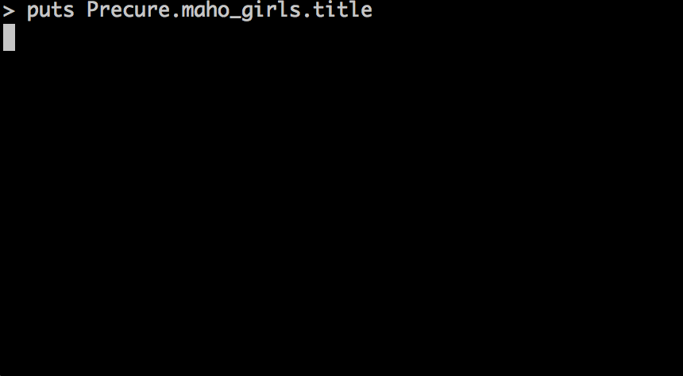

# Rubicure (Ruby + Precure)

[](http://badge.fury.io/rb/rubicure)
[](https://github.com/sue445/rubicure/actions?query=workflow%3Atest)
[](https://codeclimate.com/github/sue445/rubicure)
[](https://coveralls.io/r/sue445/rubicure)

All about Japanese battle heroine "Pretty Cure (Precure)".

Inspired by [Acme::PrettyCure](http://perl-users.jp/articles/advent-calendar/2010/acme/6) and [pycure](https://github.com/drillbits/pycure).

## Example


[examples/maho_girls.rb](examples/maho_girls.rb)

## Supporting
see followings

* [config/girls/](config/girls/)

## Requirements

* Ruby
  * see `spec.required_ruby_version` in [rubicure.gemspec](rubicure.gemspec)

## Installation

Add this line to your application's Gemfile:

```ruby
gem 'rubicure'

# for ruby 2.2
gem 'backport_dig'
```

And then execute:

    $ bundle

Or install it yourself as:

    $ gem install rubicure

## Usage

```ruby
>> require "rubicure"
```

### Select own precure series

```ruby
>> Precure.title
=> "ふたりはプリキュア"

>> Precure.unmarked.title
=> "ふたりはプリキュア"

>> Precure.max_heart.title
=> "ふたりはプリキュア Max Heart"

>> Precure.splash_star.title
=> "ふたりはプリキュア Splash☆Star"

>> Precure.yes.title
=> "Yes！ プリキュア5"

>> Precure.yes_gogo.title
=> "Yes！ プリキュア5 Go Go！"

>> Precure.fresh.title
=> "フレッシュプリキュア！"

>> Precure.heart_catch.title
=> "ハートキャッチプリキュア！"

>> Precure.suite.title
=> "スイートプリキュア♪"

>> Precure.smile.title
=> "スマイルプリキュア！"

>> Precure.dokidoki.title
=> "ドキドキ！プリキュア"

>> Precure.happiness_charge.title
=> "ハピネスチャージプリキュア！"

>> Precure.go_princess.title
=> "Go!プリンセスプリキュア"

>> Precure.maho_girls.title
=> "魔法つかいプリキュア！"

>> Precure.a_la_mode.title
=> "キラキラ☆プリキュアアラモード"

>> Precure.hugtto.title
=> "ＨＵＧっと！プリキュア"

>> Precure.dokidoki
=> {:series_name=>"dokidoki", :title=>"ドキドキ！プリキュア", :started_date=>#<Date: 2013-02-03 ((2456327j,0s,0n),+0s,2299161j)>, :ended_date=>#<Date: 2014-01-26 ((2456684j,0s,0n),+0s,2299161j)>, :girls=>["cure_heart", "cure_diamond", "cure_rosetta", "cure_sword", "cure_ace"]}
```

other pattern

```ruby
>> Rubicure::Series.find(:smile).title
=> "スマイルプリキュア！"
```

and [more aliases!](config/series.yml)

### Get current precure series
`Precure#now` (alias to `#current` ) return current precure series

```ruby
>> Precure.now
=> {:series_name=>"delicious_party", :title=>"デリシャスパーティ♡プリキュア", :started_date=>#<Date: 2022-02-06 ((2459617j,0s,0n),+0s,2299161j)>, :girls=>["cure_precious", "cure_spicy", "cure_yumyum", "cure_finale"]}

# -2013/1/27  : smile precure
#  2013/2/5 - : dokidoki precure
require "delorean"
Delorean.time_travel_to "2013-02-01"
Precure.now
#=> RuntimeError: Not on air precure!
```

### Rubicure::Series#on_air?

```ruby
>> Precure.dokidoki.on_air?("2013-12-16")
=> true

>> Precure.smile.on_air?("2013-12-16")
=> false
```

### Rubicure::Series#girls
```ruby
>> Precure.smile.girls.count
=> 5

>> Precure.smile.girls.first
=> {:girl_name=>"cure_happy", :human_name=>"星空みゆき", :precure_name=>"キュアハッピー", :cast_name=>"福圓美里", :created_date=>#<Date: 2012-02-05 ((2455963j,0s,0n),+0s,2299161j)>, :color=>"pink", :transform_message=>"(レディ？)\nプリキュア・スマイルチャージ！\n(ゴー！ゴー！レッツ・ゴー！ハッピー！！)\nキラキラ輝く未来の光！ キュアハッピー！\n5つの光が導く未来！\n輝け！スマイルプリキュア！", :extra_names=>["プリンセスハッピー", "ウルトラハッピー"], :attack_messages=>["プリキュア！ハッピーシャワー！！", "開け、ロイヤルクロック！\n(みんなの力を1つにするクル！)\n届け、希望の光！\nはばたけ！光り輝く未来へ！\nプリキュア！ロイヤルレインボーバースト！", "(みんなの力を1つにするクル！)\nプリキュア！ミラクルレインボーバースト！\n輝けー！！\nスマイルプリキュア！！"], :transform_calls=>["smile_charge"]}

>> Precure.smile.girls.map(&:human_name)
=> ["星空みゆき", "日野あかね", "黄瀬やよい", "緑川なお", "青木れいか"]

>> Precure.smile.girls.map(&:precure_name)
=> ["キュアハッピー", "キュアサニー", "キュアピース", "キュアマーチ", "キュアビューティ"]

>> Precure.smile.girls.count
=> 5
```

### Select own precure girl
```ruby
>> Cure.lemonade
=> {:girl_name=>"cure_lemonade", :human_name=>"春日野うらら", :precure_name=>"キュアレモネード", :cast_name=>"伊瀬茉莉也", :created_date=>#<Date: 2007-02-18 ((2454150j,0s,0n),+0s,2299161j)>, :color=>"yellow", :transform_message=>"プリキュア！メタモルフォーゼ！\nはじけるレモンの香り、キュアレモネード！\n希望の力と未来の光！\n華麗に羽ばたく5つの心！\nYes！プリキュア5！", :extra_names=>nil, :attack_messages=>["輝く乙女のはじける力、受けてみなさい！\nプリキュア！プリズム・チェーン！"], :transform_calls=>["metamorphose"]}

>> Cure.pine
=> {:girl_name=>"cure_pine", :human_name=>"山吹祈里", :precure_name=>"キュアパイン", :cast_name=>"中川亜紀子", :created_date=>#<Date: 2009-02-15 ((2454878j,0s,0n),+0s,2299161j)>, :color=>"yellow", :transform_message=>"チェインジ！プリキュア・ビートアップ！\nイエローハートは祈りのしるし！\nとれたてフレッシュ、キュアパイン！\nレッツプリキュア！", :extra_names=>["キュアエンジェルパイン"], :attack_messages=>["悪いの悪いの飛んでいけ！\nプリキュア！ヒーリングプレアーフレッシュ！"], :transform_calls=>["change_precure_beat_up", "change", "beat_up"]}

>> Cure.sunshine
=> {:girl_name=>"cure_sunshine", :human_name=>"明堂院いつき", :precure_name=>"キュアサンシャイン", :cast_name=>"桑島法子", :created_date=>#<Date: 2010-07-18 ((2455396j,0s,0n),+0s,2299161j)>, :color=>"yellow", :transform_message=>"(プリキュアの種、いくですぅ！)\nプリキュア！オープンマイハート！\n陽の光浴びる一輪の花！ キュアサンシャイン！\nハートキャッチ、プリキュア！", :extra_names=>["スーパーキュアサンシャイン"], :attack_messages=>["花よ、舞い踊れ！\nプリキュア！ゴールドフォルテバースト！！", "花よ、咲き誇れ！\nプリキュア・ハートキャッチ・オーケストラ！！"], :transform_calls=>["open_my_heart"]}

>> Cure.muse
=> {:girl_name=>"cure_muse", :human_name=>"調辺アコ", :precure_name=>"キュアミューズ", :cast_name=>"大久保瑠美", :created_date=>#<Date: 2011-10-16 ((2455851j,0s,0n),+0s,2299161j)>, :color=>"yellow", :transform_message=>"レッツプレイ！プリキュアモジュレーション！！\n爪弾くは女神の調べ！ キュアミューズ！\n届け4人の組曲！スイートプリキュア！", :extra_names=>["クレッシェンドミューズ"], :attack_messages=>["おいで、シリー！\nシの音符の、シャイニングメロディ！\nプリキュア！スパークリングシャワー！！\n三拍子！１、２、３\nフィナーレ！", "届けましょう、希望のシンフォニー！\nプリキュア！スイートセッションアンサンブル！\nクレッシェンド！！\nフィナーレ！"], :transform_calls=>["lets_play_precure_modulation", "lets_play", "modulation"]}

>> Cure.peace
=> {:girl_name=>"cure_peace", :human_name=>"黄瀬やよい", :precure_name=>"キュアピース", :cast_name=>"金元寿子", :created_date=>#<Date: 2012-02-19 ((2455977j,0s,0n),+0s,2299161j)>, :color=>"yellow", :transform_message=>"(レディ？)\nプリキュア・スマイルチャージ！\n(ゴー！ゴー！レッツ・ゴー！ピース！！)\nピカピカピカリンジャンケンポン！ キュアピース！\n5つの光が導く未来！\n輝け！スマイルプリキュア！", :extra_names=>["プリンセスピース", "ウルトラピース"], :attack_messages=>["プリキュア！ピースサンダー！！", "開け、ロイヤルクロック！\n(みんなの力を1つにするクル！)\n届け、希望の光！\nはばたけ！光り輝く未来へ！\nプリキュア！ロイヤルレインボーバースト！", "(みんなの力を1つにするクル！)\nプリキュア！ミラクルレインボーバースト！\n輝けー！！\nスマイルプリキュア！！"], :transform_calls=>["smile_charge"]}

>> Cure.rosetta
=>  {:girl_name=>"cure_rosetta", :human_name=>"四葉ありす", :precure_name=>"キュアロゼッタ", :cast_name=>"渕上舞", :created_date=>#<Date: 2013-02-24 ((2456348j,0s,0n),+0s,2299161j)>, :color=>"yellow", :birthday=>"5/28", :transform_message=>"プリキュアラブリンク！\nL! O! V! E!\nひだまりポカポカ キュアロゼッタ！\n響け愛の鼓動！ドキドキプリキュア！\n世界を制するのは愛だけです、\nさぁ、あなたも私と愛を育んでくださいな", :extra_names=>nil, :attack_messages=>["カッチカチの！ロゼッタウォール！"], :transform_calls=>["love_link"]}

>> Cure.honey
=> {:girl_name=>"cure_honey", :human_name=>"大森ゆうこ", :precure_name=>"キュアハニー", :cast_name=>"北川里奈", :created_date=>#<Date: 2014-03-15 ((2456732j,0s,0n),+0s,2299161j)>, :color=>"yellow", :transform_message=>"(かわルンルン！)\nプリキュアくるりんミラーチェンジ！\n大地に実る命の光！キュアハニー！\nハピネス注入！幸せチャージ！\nハピネスチャージプリキュア！", :extra_names=>["キュアハニー ポップコーンチア"], :attack_messages=>["命の光を聖なる力へ！\nハニーバトン！\nプリキュア！スパークリングバトンアタック！！\nイエイ！\n命よ、天に帰れ！\n(ゴクラ〜ク…)", "(かわルンルン！)\nプリキュアくるりんミラーチェンジ！ポップコーンチア！！\nプリキュア！リボンハートエクスプロージョン！！\nビクトリー！！", "(かわルンルン！)\nプリキュアくるりんミラーチェンジ！ココナッツサンバ！！\nプリキュア！マラカスリズムスパーク！！\nマンボ！！"], :transform_calls=>["kururin_mirror_change"]}

>> Shiny.luminous
=> {:girl_name=>"shiny_luminous", :human_name=>"九条ひかり", :precure_name=>"シャイニールミナス", :cast_name=>"田中理恵", :created_date=>#<Date: 2005-03-06 ((2453436j,0s,0n),+0s,2299161j)>, :color=>"yellow", :birthday=>"9/9", :transform_message=>"ルミナス・シャイニングストリーム！\n輝く命、シャイニールミナス！\n光の心と光の意志、すべてを一つにするために！", :extra_names=>nil, :attack_messages=>["光の意志よ！私に勇気を！希望と力を！！\nルミナス・ハーティエル・アンクション！"], :transform_calls=>["shining_stream"]}

>> Milky.rose
=> {:girl_name=>"milky_rose", :human_name=>"美々野くるみ", :precure_name=>"ミルキィローズ", :cast_name=>"仙台エリ", :created_date=>#<Date: 2008-04-06 ((2454563j,0s,0n),+0s,2299161j)>, :color=>"purple", :transform_message=>"スカイローズ・トランスレイト！\n青いバラは秘密のしるし！ ミルキィローズ！", :extra_names=>nil, :attack_messages=>["邪悪な力を包み込む\nバラの吹雪を咲かせましょう！\nミルキィローズ・ブリザード！"], :transform_calls=>["sky_rose_translate", "translate"]}
```

and [more aliases!](config/girls/)

### Rubicure::Girl
```ruby
# For speed up `rubydoctest README.md`
>> Rubicure::Girl.sleep_sec = 0

# these are same
>> yayoi = Cure.peace
>> yayoi = Precure.smile.girls[2]

>> yayoi.name
=> "黄瀬やよい"

>> yayoi.cast_name
=> "金元寿子"

>> # yayoi.attack!
=> # Rubicure::RequireTransformError: require transform


>> yayoi.transform!

(レディ？)
プリキュア・スマイルチャージ！
(ゴー！ゴー！レッツ・ゴー！ピース！！)
ピカピカピカリンジャンケンポン！ キュアピース！
5つの光が導く未来！
輝け！スマイルプリキュア！

# 1st transform
>> yayoi.name
=> "キュアピース"

>> yayoi.attack!

プリキュア！ピースサンダー！！

# 2nd transform
>> yayoi.transform!
>> yayoi.name
=> "プリンセスピース"

>> yayoi.attack!

開け、ロイヤルクロック！
(みんなの力を1つにするクル！)
届け、希望の光！
はばたけ！光り輝く未来へ！
プリキュア！ロイヤルレインボーバースト！

# final transform
>> yayoi.transform!
>> yayoi.name
=> "ウルトラピース"

>> yayoi.attack!

(みんなの力を1つにするクル！)
プリキュア！ミラクルレインボーバースト！
輝けー！！
スマイルプリキュア！！

# back to human
>> yayoi.humanize!
>> yayoi.name
=> "黄瀬やよい"
```

### Specific transform
```ruby
>> Cure.black.dual_aurora_wave!
デュアル・オーロラ・ウェイブ！！
光の使者、キュアブラック！
ふたりはプリキュア！
闇の力のしもべ達よ！
とっととお家に帰りなさい！

>> Cure.luminous.shining_stream!
ルミナス・シャイニングストリーム！
輝く命、シャイニールミナス！
光の心と光の意志、すべてを一つにするために！

>> Cure.bloom.dual_spiritual_power!
デュアル・スピリチュアル・パワー！
花開け大地に！
輝く金の花！ キュアブルーム！
ふたりはプリキュア！
聖なる泉を汚す者よ！
阿漕な真似はお止めなさい！

>> Cure.dream.metamorphose!
プリキュア！メタモルフォーゼ！
大いなる希望の力、キュアドリーム！
希望の力と未来の光！
華麗に羽ばたく5つの心！
Yes！プリキュア5！

>> Milky.rose.sky_rose_translate!
スカイローズ・トランスレイト！
青いバラは秘密のしるし！ ミルキィローズ！

>> Cure.peach.change_precure_beat_up!
チェインジ！プリキュア・ビートアップ！
ピンクのハートは愛あるしるし！
もぎたてフレッシュ、キュアピーチ！
レッツプリキュア！

>> Cure.blossom.open_my_heart!
(プリキュアの種、いくですぅ！)
プリキュア！オープンマイハート！
大地に咲く一輪の花！ キュアブロッサム！
ハートキャッチ、プリキュア！

>> Cure.melody.lets_play_precure_modulation!
レッツプレイ！プリキュアモジュレーション！！
爪弾くは荒ぶる調べ！ キュアメロディ！
届け4人の組曲！スイートプリキュア！

>> Cure.happy.smile_charge!
(レディ？)
プリキュア・スマイルチャージ！
(ゴー！ゴー！レッツ・ゴー！ハッピー！！)
キラキラ輝く未来の光！ キュアハッピー！
5つの光が導く未来！
輝け！スマイルプリキュア！

>> Cure.heart.love_link!
プリキュアラブリンク！
L! O! V! E!
みなぎる愛！ キュアハート！
響け愛の鼓動！ドキドキプリキュア！
愛を無くした悲しいジコチューさん、
このキュアハートがあなたのドキドキ取り戻してみせる！

>> Cure.ace.dress_up!
プリキュアドレスアップ！
(キュピラッパー！)
愛の切り札！ キュアエース！
響け愛の鼓動！ドキドキプリキュア！
美しさは正義の証し、ウインク一つで、
あなたのハートを射抜いて差し上げますわ

>> Cure.lovely.kururin_mirror_change!
(かわルンルン！)
プリキュアくるりんミラーチェンジ！
世界に広がるビッグな愛！キュアラブリー！
ハピネス注入！幸せチャージ！
ハピネスチャージプリキュア！

>> Cure.fortune.kirarin_star_symphony!
(かわルンルン！)
プリキュアきらりんスターシンフォニー！
夜空にきらめく希望の星！キュアフォーチュン！
ハピネス注入！幸せチャージ！
ハピネスチャージプリキュア！

>> Cure.flora.princess_engage!
プリキュア！プリンセスエンゲージ！
咲き誇る花のプリンセス！キュアフローラ！
強く、やさしく、美しく！
Go!プリンセスプリキュア！
冷たい檻に閉ざされた夢、返していただきますわ！
お覚悟はよろしくて？

>> Cure.whip.cure_la_mode_decoration!
キュアラモード・デコレーション！
ショートケーキ！
元気と笑顔を！
レッツ・ラ・まぜまぜ！
キュアホイップ！できあがり！
キラキラ☆プリキュアアラモード！

>> Cure.yell.heart_kiratto!
ミライクリスタル！
ハートキラっと！
は～ぎゅ～～！
ぎゅ～！
ぎゅ～～！
輝く未来を抱きしめて！
みんなを応援！元気のプリキュア！キュアエール！
```

### When [Maho Girls PreCure!](https://en.wikipedia.org/wiki/Maho_Girls_PreCure!)
```ruby
>> mirai = Cure.miracle

>> mirai.name
=> "朝日奈みらい"

>> mirai.cure_up_rapapa! :diamond
# or
# mirai.transform! :diamond

キュアップ・ラパパ！　ダイヤ！
ミラクル・マジカル・ジュエリーレ！
ふたりの奇跡！キュアミラクル！
魔法つかいプリキュア！！

>> mirai.name
=> "キュアミラクル（ダイヤスタイル）"

>> mirai.attack!
リンクルステッキ！
ダイヤ！永遠の輝きを私達の手に！
フルフルリンクル！
プリキュア！ダイヤモンドエターナル！

>> mirai.humanize!

>> mirai.name
=> "朝日奈みらい"

>> mirai.cure_up_rapapa! :ruby
# or
# mirai.transform! :ruby

キュアップ・ラパパ！　ルビー！
ミラクル・マジカル・ジュエリーレ！
ふたりの奇跡！キュアミラクル！
魔法つかいプリキュア！！

>> mirai.name
=> "キュアミラクル（ルビースタイル）"

>> mirai.attack!
リンクルステッキ！
ルビー！紅の情熱よ私達の手に！
フルフルリンクル！
プリキュア！ルビーパッショナーレ！
```

### When [Tropical-Rouge! Precure](https://en.wikipedia.org/wiki/Tropical-Rouge!_Pretty_Cure)
In Tropical Rouge Precure's `#transform!` (a.k.a. `#precure_tropical_change!`), the transformation message will be randomized as in the original work.

Example


[examples/tropical_rouge.rb](examples/tropical_rouge.rb)

### full_name
When `Rubicure::Girl` has `human_full_name` (i.e. another `human_name`), she returns as `#full_name`

```ruby
>> Cure.princess.human_name
=> "白雪ひめ"
>> Cure.princess.full_name
=> "ヒメルダ・ウインドウ・キュアクイーン・オブ・ザ・ブルースカイ"

>> Cure.scarlet.human_name
=> "紅城トワ"
>> Cure.scarlet.full_name
=> "プリンセス・ホープ・ディライト・トワ"
```

`#full_name` returns `#human_name` when she doe's not have `human_full_name`

```ruby
>> Cure.miracle.human_name
=> "朝日奈みらい"
>> Cure.miracle.full_name
=> "朝日奈みらい"
```

### Precure allstars
```ruby
>> Precure.all_stars.count
>> Precure.all_stars.map(&:precure_name)
# returns current precure count and names

>> Precure.all_stars.include?(Cure.echo)
=> false

>> Precure.all_stars("2013-10-26").count
=> 33

>> Precure.all_stars(:dx).count
=> 14

>> Precure.all_stars(:dx2).count
=> 17

>> Precure.all_stars(:dx3).count
=> 21

>> Precure.all_stars(:new_stage).count
=> 29
>> Precure.all_stars(:new_stage).include?(Cure.echo)
=> true

>> Precure.all_stars(:new_stage2).count
=> 32

>> Precure.all_stars(:new_stage3).count
=> 37
>> Precure.all_stars(:new_stage3).include?(Cure.echo)
=> true

>> Precure.all_stars(:spring_carnival).count
=> 40

>> Precure.all_stars(:sing_together_miracle_magic).count
=> 44
>> Precure.all_stars(:sing_together_miracle_magic).include?(Cure.echo)
=> true

>> Precure.all_stars(:memories).count
=> 55
```

and [more aliases!](config/movies.yml)

### `Precure.all_girls` (a.k.a. `Precure.all`)
```ruby
>> Precure.all_girls.count
>> Precure.all_girls.map(&:precure_name)
# returns current precure count and names

>> Precure.all_girls("2013-10-26").count
=> 34

>> Precure.all_girls.include?(Cure.echo)
=> true
```

#### `Precure.all_girls` vs `Precure.all_stars`
* `Precure.all_girls` returns all precure. (includes "Kirakira Precure Alamode")
* `Precure.all_stars` returns only from "Futari wa Pretty Cure" to "Maho Girls PreCure"

### `Precure.dream_stars`
```ruby
>> Precure.dream_stars.count
=> 12

>> Precure.dream_stars.map(&:precure_name)
=> ["キュアフローラ", "キュアマーメイド", "キュアトゥインクル", "キュアスカーレット", "キュアミラクル", "キュアマジカル", "キュアフェリーチェ", "キュアホイップ", "キュアカスタード", "キュアジェラート", "キュアマカロン", "キュアショコラ"]
```

### `Precure.super_stars`
```ruby
>> Precure.super_stars.count
=> 12

>> Precure.super_stars.map(&:precure_name)
=> ["キュアミラクル", "キュアマジカル", "キュアフェリーチェ", "キュアホイップ", "キュアカスタード", "キュアジェラート", "キュアマカロン", "キュアショコラ", "キュアパルフェ", "キュアエール", "キュアアンジュ", "キュアエトワール"]
```

### `Precure.miracle_universe`
```ruby
>> Precure.miracle_universe.count
=> 15

>> Precure.miracle_universe.map(&:precure_name)
=> ["キュアホイップ", "キュアカスタード", "キュアジェラート", "キュアマカロン", "キュアショコラ", "キュアパルフェ", "キュアエール", "キュアアンジュ", "キュアエトワール", "キュアマシェリ", "キュアアムール", "キュアスター", "キュアミルキー", "キュアソレイユ", "キュアセレーネ"]
```

### `Precure.miracle_leap`
```ruby
>> Precure.miracle_leap.count
=> 13

>> Precure.miracle_leap.map(&:precure_name)
=> ["キュアエール", "キュアアンジュ", "キュアエトワール", "キュアマシェリ", "キュアアムール", "キュアスター", "キュアミルキー", "キュアソレイユ", "キュアセレーネ", "キュアコスモ", "キュアグレース", "キュアフォンテーヌ", "キュアスパークル"]
```

### Equivalence
```ruby
>> yayoi = Cure.peace.dup
>> cure_peace = Cure.peace.dup.transform!

>> yayoi == cure_peace
=> true
```

```ruby
precure = Rubicure::Girl.find(:passion)

case precure
when Precure.dokidoki
  puts "The girl is a member of Dokidoki! Precure"
when Precure.fresh
  puts "The girl is a member of Fresh Precure!"
else
  puts "The girl is not which member of Dokidoki! Precure and Fresh Precure!"
end
```

### Pikarin janken
```ruby
Cure.peace.pikarin_janken
ピカピカピカリン
ジャンケンポン！
（パー）
#=> "ピカピカピカリン\nジャンケンポン！\n（パー）\n"

Cure.peace.janken
ピカピカピカリン
ジャンケンポン！
（グー）
#=> "ピカピカピカリン\nジャンケンポン！\n（グー）\n"
```

### one-liner

```
§ ruby -rubicure -e'puts Shiny.luminous.transform_message'
```

### Enumerable
```ruby
>> Precure.each{|series| puts series.title  }
ふたりはプリキュア
ふたりはプリキュア Max Heart
ふたりはプリキュア Splash☆Star
Yes！ プリキュア5
Yes！ プリキュア5 Go Go！
フレッシュプリキュア！
ハートキャッチプリキュア！
スイートプリキュア♪
スマイルプリキュア！
ドキドキ！プリキュア
ハピネスチャージプリキュア！
Go!プリンセスプリキュア
魔法つかいプリキュア！
キラキラ☆プリキュアアラモード
ＨＵＧっと！プリキュア
スター☆トゥインクルプリキュア
ヒーリングっど♥プリキュア
トロピカル～ジュ！プリキュア
デリシャスパーティ♡プリキュア
=> [:unmarked, :max_heart, :splash_star, :yes, :yes_gogo, :fresh, :heart_catch, :suite, :smile, :dokidoki, :happiness_charge, :go_princess, :maho_girls, :a_la_mode, :hugtto, :star_twinkle, :healingood, :tropical_rouge, :delicious_party]

>> Precure.inject([]){|girl_count_of_series, series| girl_count_of_series << series.girls.count; girl_count_of_series  }
=> [2, 3, 2, 5, 6, 4, 4, 4, 5, 5, 4, 4, 3, 6, 5, 5, 4, 5, 4]

>> Precure.map(&:title)
=> ["ふたりはプリキュア", "ふたりはプリキュア Max Heart", "ふたりはプリキュア Splash☆Star", "Yes！ プリキュア5", "Yes！ プリキュア5 Go Go！", "フレッシュプリキュア！", "ハートキャッチプリキュア！", "スイートプリキュア♪", "スマイルプリキュア！", "ドキドキ！プリキュア", "ハピネスチャージプリキュア！", "Go!プリンセスプリキュア", "魔法つかいプリキュア！", "キラキラ☆プリキュアアラモード", "ＨＵＧっと！プリキュア", "スター☆トゥインクルプリキュア", "ヒーリングっど♥プリキュア", "トロピカル～ジュ！プリキュア", "デリシャスパーティ♡プリキュア"]

>> Precure.happiness_charge.map(&:precure_name)
=> ["キュアラブリー", "キュアプリンセス", "キュアハニー", "キュアフォーチュン"]

>> Precure.map{|series| series.map(&:precure_name) }
=> [["キュアブラック", "キュアホワイト"], ["キュアブラック", "キュアホワイト", "シャイニールミナス"], ["キュアブルーム", "キュアイーグレット"], ["キュアドリーム", "キュアルージュ", "キュアレモネード", "キュアミント", "キュアアクア"], ["キュアドリーム", "キュアルージュ", "キュアレモネード", "キュアミント", "キュアアクア", "ミルキィローズ"], ["キュアピーチ", "キュアベリー", "キュアパイン", "キュアパッション"], ["キュアブロッサム", "キュアマリン", "キュアサンシャイン", "キュアムーンライト"], ["キュアメロディ", "キュアリズム", "キュアビート", "キュアミューズ"], ["キュアハッピー", "キュアサニー", "キュアピース", "キュアマーチ", "キュアビューティ"], ["キュアハート", "キュアダイヤモンド", "キュアロゼッタ", "キュアソード", "キュアエース"], ["キュアラブリー", "キュアプリンセス", "キュアハニー", "キュアフォーチュン"], ["キュアフローラ", "キュアマーメイド", "キュアトゥインクル", "キュアスカーレット"], ["キュアミラクル", "キュアマジカル", "キュアフェリーチェ"], ["キュアホイップ", "キュアカスタード", "キュアジェラート", "キュアマカロン", "キュアショコラ", "キュアパルフェ"], ["キュアエール", "キュアアンジュ", "キュアエトワール", "キュアマシェリ", "キュアアムール"], ["キュアスター", "キュアミルキー", "キュアソレイユ", "キュアセレーネ", "キュアコスモ"], ["キュアグレース", "キュアフォンテーヌ", "キュアスパークル", "キュアアース"], ["キュアサマー", "キュアコーラル", "キュアパパイア", "キュアフラミンゴ", "キュアラメール"], ["キュアプレシャス", "キュアスパイシー", "キュアヤムヤム", "キュアフィナーレ"]]
```

### Not operator
#### !Cure.passion
```ruby
>> passion = Cure.passion
>> passion.name
=> "東せつな"

>> !passion

>> passion.name
=> "イース"
```

#### !Cure.beat
```ruby
>> beat = Cure.beat

>> beat.name
=> "黒川エレン"

>> !beat

>> beat.name
=> "セイレーン"
```

#### !Cure.scarlet
```ruby
>> scarlet = Cure.scarlet
>> scarlet.name
=> "紅城トワ"

>> !scarlet

>> scarlet.name
=> "トワイライト"
```

#### !Cure.finale
```ruby
>> finale = Cure.finale
>> finale.name
=> "菓彩あまね"

>> !finale

>> finale.name
=> "ジェントルー"
```

### Cure.cosmo.transform!(:rainbow_perfume)
```ruby
Cure.cosmo.transform!(:rainbow_perfume)
レインボーパフュームいくニャン！

Cure.cosmo.name
#=> one of "マオ", "ブルーキャット" or "バケニャーン"
```

## Color methods
```ruby
>> Cure.peace.color
=> "yellow"

>> Cure.happy.color
=> "pink"

>> Cure.peace.yellow?
=> true

>> Cure.peace.pink?
=> false

>> Cure.happy.pink?
=> true

>> Rubicure::Girl.colors
=> [:black, :blue, :gold, :green, :pink, :purple, :rainbow, :red, :white, :yellow]

>> Precure.all_girls.select(&:pink?).map(&:precure_name)
=> ["キュアブルーム", "キュアドリーム", "キュアピーチ", "キュアブロッサム", "キュアメロディ", "キュアハッピー", "キュアハート", "キュアラブリー", "キュアフローラ", "キュアミラクル", "キュアホイップ", "キュアエール", "キュアスター", "キュアグレース", "キュアプレシャス"]

>> Precure.all_girls.select(&:yellow?).map(&:precure_name)
=> ["シャイニールミナス", "キュアレモネード", "キュアパイン", "キュアサンシャイン", "キュアミューズ", "キュアピース", "キュアロゼッタ", "キュアハニー", "キュアトゥインクル", "キュアカスタード", "キュアエトワール", "キュアソレイユ", "キュアスパークル", "キュアパパイア", "キュアヤムヤム"]

>> Precure.all_girls.group_by{ |girl| girl.color }.map{ |color, girls| [color, girls.count] }.sort_by{ |color, girl_count| [girl_count, color] }.reverse
=> [["yellow", 15], ["pink", 15], ["blue", 13], ["purple", 10], ["red", 8], ["white", 5], ["green", 4], ["rainbow", 2], ["gold", 1], ["black", 1]]
```

### birthday methods
```ruby
>> Cure.peace.have_birthday?
=> false

>> Cure.twinkle.has_birthday?
=> true
>> Cure.twinkle.birthday
=> "9/12"

>> require "delorean"
>> Delorean.time_travel_to "2015-11-24"
>> Date.today
=> #<Date: 2015-11-24 ((2457351j,0s,0n),+0s,2299161j)>
>> Cure.twinkle.birthday?
=> false

>> Delorean.back_to_the_present

>> Cure.twinkle.birthday?(Date.parse("2015-9-12"))
=> true

>> Precure.all_girls.select(&:have_birthday?).map(&:human_name)
=> ["美墨なぎさ", "雪城ほのか", "九条ひかり", "日向咲", "美翔舞", "相田マナ", "菱川六花", "四葉ありす", "剣崎真琴", "春野はるか", "海藤みなみ", "天ノ川きらら", "紅城トワ", "朝日奈みらい", "十六夜リコ", "宇佐美いちか", "有栖川ひまり", "立神あおい", "琴爪ゆかり", "剣城あきら", "キラ星シエル", "野乃はな", "薬師寺さあや", "輝木ほまれ", "愛崎えみる", "ルールー・アムール", "星奈ひかる", "羽衣ララ", "天宮えれな", "香久矢まどか", "ユニ", "花寺のどか", "沢泉ちゆ", "平光ひなた", "風鈴アスミ", "夏海まなつ", "涼村さんご", "一ノ瀬みのり", "滝沢あすか", "ローラ・ラメール", "和実ゆい", "芙羽ここね", "華満らん", "菓彩あまね"]
>> Precure.all_girls.select(&:have_birthday?).sort_by { |girl| Date.parse(girl.birthday) }.map{ |girl| [girl.birthday, girl.human_name]  }
=> [["1/7", "宇佐美いちか"], ["1/20", "野乃はな"], ["3/9", "花寺のどか"], ["3/13", "芙羽ここね"], ["4/4", "雪城ほのか"], ["4/8", "輝木ほまれ"], ["4/10", "春野はるか"], ["4/12", "星奈ひかる"], ["4/16", "有栖川ひまり"], ["5/9", "涼村さんご"], ["5/28", "四葉ありす"], ["6/10", "薬師寺さあや"], ["6/11", "琴爪ゆかり"], ["6/12", "朝日奈みらい"], ["6/30", "ローラ・ラメール"], ["7/7", "羽衣ララ"], ["7/11", "華満らん"], ["7/15", "愛崎えみる"], ["7/20", "海藤みなみ"], ["7/30", "キラ星シエル"], ["8/1", "夏海まなつ"], ["8/4", "相田マナ"], ["8/7", "日向咲"], ["8/16", "風鈴アスミ"], ["8/21", "沢泉ちゆ"], ["8/27", "立神あおい"], ["8/31", "和実ゆい"], ["9/8", "天宮えれな"], ["9/9", "九条ひかり"], ["9/12", "天ノ川きらら"], ["9/17", "菱川六花"], ["9/23", "ルールー・アムール"], ["9/24", "剣城あきら"], ["10/4", "平光ひなた"], ["10/10", "美墨なぎさ"], ["10/11", "ユニ"], ["10/15", "滝沢あすか"], ["11/4", "剣崎真琴"], ["11/12", "十六夜リコ"], ["11/20", "美翔舞"], ["11/21", "一ノ瀬みのり"], ["11/23", "香久矢まどか"], ["11/24", "菓彩あまね"], ["12/15", "紅城トワ"]]

>> Precure.all_girls.select(&:have_birthday?).map(&:human_name).count
=> 44
```

* `has_birthday?` is alias to `have_birthday?`

### `Rubicure::Girl#heisei?` and `Rubicure::Girl#reiwa?`
```ruby
>> Cure.star.heisei?
=> true
>> Cure.star.reiwa?
=> false

>> Cure.cosmo.heisei?
=> false
>> Cure.cosmo.reiwa?
=> true
```

### `Rubicure::Series#heisei?` and `Rubicure::Series#reiwa?`
```ruby
>> Precure.hugtto.heisei?
=> true
>> Precure.hugtto.reiwa?
=> false

>> Precure.star_twinkle.heisei?
=> true
>> Precure.star_twinkle.reiwa?
=> true
```

## More reference
http://sue445.github.io/rubicure/

## Versioning Policy
`rubicure` uses **Semantic Cure Versioning** :heart:

* Patch version up
  * e.g. `1.1.1` -> `1.1.2`
  * Containing bugfix
* Minor version up
  * e.g. `1.1.1` -> `1.2.0`
  * **Addition of Precure series**
  * Not containing only addition features :kissing_heart:
* Major version up
  * e.g. `1.1.1` -> `2.0.0`
  * Containing breaking changes

## Contributing

1. Fork it
2. Create your feature branch (`git checkout -b my-new-feature`)
3. Commit your changes (`git commit -am 'Add some feature'`)
4. Push to the branch (`git push origin my-new-feature`)
5. Create new Pull Request
